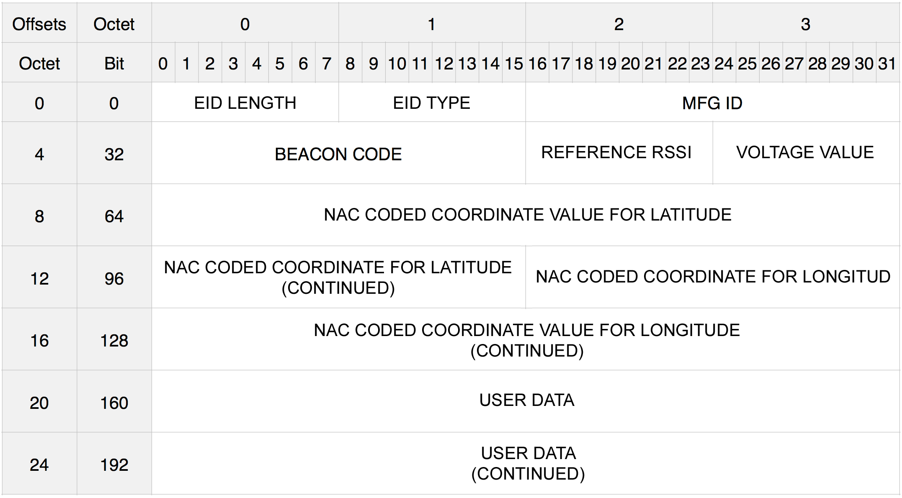

/******************************************************************************
 * Name:      README.md
 * Purpose:   GeoBeacon Protocol Specification v1.0
 * Author:    Ingolf Tippner (info@tecno-world.com)
 * Created:   2017-07-12
 * Copyright (C) 2017  Ingolf Tippner (Tecno-World, Pitius Tec S.L.)

 * This program is free software: you can redistribute it and/or modify
 * it under the terms of the GNU General Public License as published by
 * the Free Software Foundation, either version 3 of the License.

 * This program is distributed in the hope that it will be useful,
 * but WITHOUT ANY WARRANTY; without even the implied warranty of
 * MERCHANTABILITY or FITNESS FOR A PARTICULAR PURPOSE.  See the
 * GNU General Public License for more details.

 * You should have received a copy of the GNU General Public License
 * along with this program.  If not, see <http://www.gnu.org/licenses/>.

 * Changelog:

********************************************************************************/
 
# GeoBeacon Protocol Specification v1.0

GeoBeacon is a protocol specification that defines a message format for proximity beacon advertisements. GeoBeacon proximity beacon advertisements are transmitted by devices for the purpose of signaling their proximity to nearby receivers. The contents of the emitted message contain information that the receiving device can use to compute its relative distance to the beacon, to check the battery status, to get Geo coordinates and to get user defined data. 

Example use cases for proximity beacons include but are not limited to:

* Notifying users that they are reached the correct spot.
* Send to the users new coordinates for the next spot or next hint.
* Sent to the users special datas, i.e. parts of a message, hints etc.

## Design Goals

The development of the GeoBeacon specification has been driven by several objectives:

1. Provide a advertising message for interchange information between advertisers and scanners specially designed for GeoCaching applications.
2. Maintain compliance with Bluetooth Specification Version 4.0 by utilizing defined advertising PDU and advertising data structures
3. Provide space for a set of two high resolution coordinates and at least 8 byte of user data.
4. Provide TLM data, at least the battery value.

## Implementation Requirements

GeoBeacon proximity beacon functionality is not limited to single-function devices, but can be incorporated as a feature of any device that is Bluetooth Low Energy compliant and which conforms to the requirements defined in _Bluetooth Specification Version 4.0, Volume 0, Part B, Section 4.4 Low Energy Core Configuration or Section 4.5 Basic Rate and Low Energy Combined Core Configuration_.

GeoBeacon advertisements are encapsulated as the payload of a non connectable undirected advertising `PDU` (`ADV_NONCONN_IND`) as defined in _Bluetooth Specification Version 4.0, Volume 6, Part B, Section 2.3 Advertising Channel PDU_.

Devices that transmit proximity beacon advertisement packets are referred to as advertisers. Devices that receive proximity beacon advertisements are referred to as scanners. These roles follow the conventions defined in _Bluetooth Specification Version 4.0, Volume 1, Part A, Section 1.2 Overview of Bluetooth Low Energy Operation_.

## GeoBeacon Coordinates

GeoBeacon uses for several reasons the NAC-Adress format. NAC (Natural Area Coding System) has a lot of benefits. 

1. It has unified the concepts of geodetic points, line sections, areas, and three-dimensional regions.
2. It employs the 30 most popular characters in the world instead of ten digits and makes full use of these characters to produce the most efficient representations;
3. It is defined only on the datum of WGS-84 to avoid any variations;
4. It creates one standard representation for all these geographic units. 
5. It is very compact and very good readable

This format offers also simple calculation for distance and/or time difference between two coordinates.

## GeoBeacon Protocol Format

The GeoBeacon advertisement makes use of the Manufacturer Specific Advertising Data structure as defined in _Bluetooth Specification Version 4.0, Volume 6, Part B, Section 2.3 Advertising Channel PDU_.

The GeoBeacon advertisement is made up of a 1-byte length field, 1-byte type field and two-byte company identifier, as prescribed by the Manufacturer Specific Advertising Data structure format, followed by 24 additional bytes containing the beacon advertisement data.

See the GeoBeacon Protocol Data and GeoBeacon Protocol Fields as described below for information on the specific fields, their descriptions and accepted values.

## GeoBeacon Protocol Diagram

## GeoBeacon Protocol Fields

Field Name               |  Description                                                                                 | Accepted Values
------------------------ | -------------------------------------------------------------------------------------------- | ---------------
EID LENGTH [MFG SPECIFIC]| Length of the type and data portion of the Manufacturer Specific advertising data structure. | `0x1B`
EID TYPE [MFG SPECIFIC]  | Type representing the Manufacturer Specific advertising data structure.                      | `0xFF`
MFG ID                   | The beacon device manufacturer's company identifier code.                                    | The little endian representation of the beacon device manufacturer's company code as maintained by the Bluetooth SIG assigned numbers database
BEACON CODE              | The GeoBeacon advertisement code                                                             | The big endian representation of the value `0x47E0` => 'G'E0
REFERENCE RSSI           | A 1-byte value representing the average received signal strength at 1m from the advertiser   | A signed 1-byte value from 0 to -127
VOLTAGE VALUE            | A 1-byte value representing the battery voltage in 16mV/bit.                                 | A unsigned 1-byte value from 0 to 255 = 0mV up to 4080mV
NAC COORDINATE LATITUDE  | A 6-byte value that represents a NAC-coded geo coordinate for the latitude                   | A valid NAC coded coordinate with a resolution of 6 digits. Please visit http://www.nacgeo.com for more details
NAC COORDINATE LONGITUD  | A 6-byte value that represents a NAC-coded geo coordinate for the longitud                   | A valid NAC coded coordinate with a resolution of 6 digits. Please visit http://www.nacgeo.com for more details
USER DATA                | 6 1-byte values for generic usage.                                                           | 6 unsigned 1-byte values from 0 to 255

